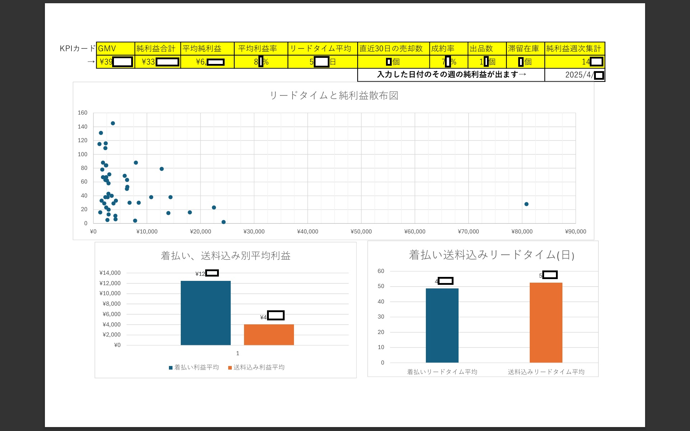

# 実務実績ポートフォリオ

> **目的**：自身が実際に行った実務における業務改善や、現場で提案したものの却下されたけど、ちゃんと動くものを作って見せれていれば実現していたであろう業務改善、実益を出している現行MCのKPIと分析データを公開。
「現場で使える再現性」と「定量で語れる改善」を示す。個人情報は完全匿名化。

---

## 目次
1. 実務：図書係業務の標準化（Library Assistant）
2. 個人運用系：メルカリ運用BOOK
3. 改善提案：体重測定
4. 改善提案（未導入病棟業務効率化）：車椅子体重測定対応型BOOK
5. 病棟レクリエーション　「夏祭り」リーダー運営

---

## 1. 実務：図書係業務の標準化（Library Assistant）（2017）

**役割**：発案・要件定義・設計・導入・教育・運用定着（リード）

**期間/体制**：2017年〜（在任2年＋離任後1年継続）／関係部署：退院支援病棟・デイナイトケア

**対象**：患者様ヒアリング対象は累計120名以上／各病棟の定期利用3–4名程度

**背景、課題**：正看護師免許取得1年目上司より、図書係打診あり。前任は手書き各所の患者へヒアリング＋印刷物のコピー＋FAXで属人化。2か月ごと作業・誤記/重複のリスク。
ヒアリング、及び転記が人依存で、患者、職員間の相性の問題、遅延・ミスが起きやすい	予算未設定で購入額が決まってない。

**施策**：（設計→導入）

Excelテンプレ群を新設：
1.	回覧板ルール記載シート（入力規約/回覧板ルート記載/締切/担当）
2.	依頼図書の合計金額シート（手打ち→合算）
3.	承認印シート（各部署の決裁順序を明文化）
4.	本屋向けFAXシート（様式統一）

	院内共有ディレクトリに図書係ディレクトリと保存用の過去ディレクトリを作成：/図書係/YYYYMM/発注/履歴/証跡（過去注文を一元保存）

回覧動線の再設計：退院支援病棟 →　部屋長 → 各病室 → NSステーション → デイナイトケア詰所 → 各部屋 → デイナイトケア詰所→連絡ボックス → 自病棟へ戻着
運用ルール：3か月に1回へ周期変更（2→3か月）、上限15,000円/回を設定しコスト統一

関係者合意：病棟師長/デイナイトケア/退院支援病棟 自治会で承認取得、周知

**結果**:（KPI/再現性）
◆工数削減：印刷後の一括確認を導入し、1回あたり１２０名の患者様に声掛け確認を取ると想定し１人１分、 120分かかると予測、約115分短縮。周期を2→3か月へ最適化し、年間約11.7時間の確認工数97％を削減。

◆コスト効果：時給ベース（1,800円）と考えたら、約２万円/年の人件費相当削減。
•	予算上限：15,000円/回でブレを抑制
•	無事故運用：在任2年、異動後1年もトラブル報告なし（計3年継続）
•	トラブルシューティング履歴確認：過去注文の参照がPC上で容易に可能に（問い合わせ・再注文が容易）

**提示物**：
[クリックでLibrary-Assistant.xlsxが開きます、ご注意](artifacts/Library-Assistant.xlsx)

> 元資料（参考）：`/artifacts/Library-Assistant.xlsx`（匿名サンプルで再構成）

---

## 3. 個人運用系：メルカリ運用BOOK
**背景**：断捨離中心の個人ECを**数字で回す**運用へ。個人情報は非公開。

**KPI**：
- GMV（売上総額）／**純利益**／**平均利率**
- **平均リードタイム**（出品→成約）/30日間の売却数
- 成約率（売却件数/出品件数）/出品数/滞留在庫/
- 純利益週次集計（yyyy/mm/dd入力すると1週間の利益表示）
- 送料区分別の差（着払い/送料込み）

**運用、分析実績**：
- **送料区分×利益×リードタイム**の関係を可視化し、
  - 初期純利益<¥1,000 → 出品見直し/処分
  - 見込<¥2,000 → まとめ売り
  - 簡易梱包で¥1,500超えないもの → 整理orまとめ売り
ダッシュボードシートで**高滞留**件数を表示、マニュアルに基づいて出品価格の調整（出品価格入力＋送料プルダウン入力からの自動純利益計算シート有り）やその他で調整する。
トラブル発生時に今後の対応策、また運用の再現性を効率運用を考慮したマニュアルシート作成。

**提示物**：

> 元資料（参考）：`/artifacts/mercari.jpg`（個人情報の関係で重要数値とグラフのみ表示します）

---

## 4. 改善提案（未導入病棟業務効率化）：車椅子体重測定対応型BOOK
**位置づけ、目的**：前職場の雑談からの、**「難しい」**の一言で、導入見送りの体重測定関係効率化Excelファイル。

- いくつかの職場を経験してきましたが、職場毎の導入調整も簡単なBOOKなので、導入したら効率化につながる職場が多くみられると判断したので公開。

**設計**：
- `ツールシート` → `作成意図（マニュアル兼ねて）` → `複合キー` の3階層
- 簡易な仕様による扱いやすさと、短時間教育からの運用、調整、再現性を配慮しました。

[クリックでWeight-measurement.xlsxが開きます、ご注意](artifacts/Weight-measurement.xlsx)
> 元試作（参考）：`/artifacts/Weight-measurement.xlsx`

---
## 5. 病棟レクリエーション　「夏祭り」リーダー運営（2024）
50名程度（職員15名:患者35名）の小規模イベントの運営を実施しました。事前の準備や細やかなタイムスケジュールを組んだことにより、予定外のトラブルもありましたが、ブース6、総費用 18,000円（予算内）／予定消化100%／インシデント・アクシデント0／残業発生0。、患者様からのフィードバックもとても良い物に仕上がりました。
医療系ではありますが、プロジェクトマネジメントの一連の流れを経験出来たと考慮したため公開。経験年数5年～10年以上の職員が2/3以上集まれば、同じ業種での再現性は高いと判断した為、公開します。

>詳細は→をクリック　[夏祭りmdリンク](summer-festival/summer-festival.md)
`summer-festival/summer-festival.md`に記載しております。

### 利用許諾
- 本READMEおよびテンプレは個人ポートフォリオ用途。二次配布不可（要相談）。

---

**連絡先**：LateBloomTech（GitHub）

