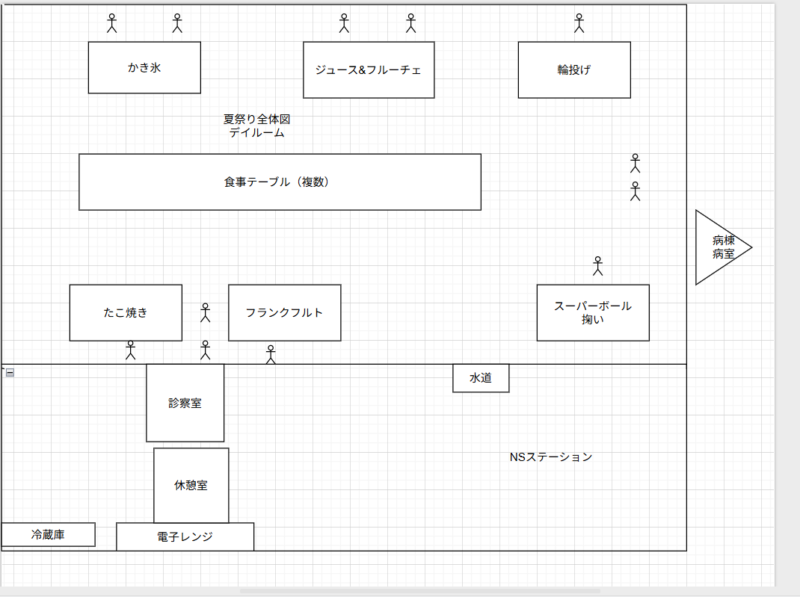

# 病棟レクリエーション「夏祭り」運営+タイムテーブル と実際

- 開催日: **2024-08-DD**
- 規模: 職員 15名 / 患者 35名（計 50名）
- ブース: スーパーボール掬い / たこ焼き / フランクフルト / かき氷 / 輪投げ / ジュース+フルーチェ
- 役割:レク委員5名、私（リーダー）職場経験年数1年、職場経験年数8年ベテランNS（以後A氏）、他職場経験年数5～1年NS3名(以後B氏,C氏,D氏) （夏祭りプロジェクト計画、企画(私、A氏)、買い出し（私、C氏）、価格調査（私、D氏）、美術担当（D氏）、物品関連部署調整（A氏）、関係調整、当日書類作成（A氏）、食事形態の確認及びDrの指示取り（B氏）

当日:荷物搬入係 / 司会・全体統括 / ブース責任者 / 患者誘導
- 連絡: 限定グループ（個人情報は紙メモ等の院内運用）

---
##　背景と直前までの流れ
-  現在は退職し、共有連絡グループも脱退している為、1年ほど前の事で有る為、思い出せる範囲で作成しております。
　7月初旬師長より、レクリエーション自分主体で行う様に依頼され、私とA氏で打ち合わせ開始。A氏より 以下 の様な図を提供、企画を開始、必要物品や、ブース、大まかな流れ、当日出勤メンバーなどを文章に起こしていく。
 
　その他のメンバーと話し合いながら役割決めを行っていき、予算は2万円で有った為、価格調査をなど行う。
開始4日前までに以下の作業が完了していた。

-  目的・対象（師長承認の書類）
-  役割分担表（統括/各ブース責任者/物品/誘導）
-  予算上限（20,000円）と費目割り
-  導線図・会場ゾーニング草案（車いす動線/導線幅）
-  在庫棚卸し（借用品の当日返却先も記載）
-  見積比較（食材/消耗品/氷/紙皿/割りばし）
-  食事形態への配慮（とろみ/刻み等の代替）
-  会場レイアウト＋ブース担当者確定（導線図）
-  必要物品、調達先リスト確定、書類作成済み

## T - 4 
- 当日のレイアウト、担当ブース、タイムテーブル予定休憩室に貼り出し。
- 価格調査を元にC氏と買い出し。

## T-3
-  試食会を行い実際の回転率、調理時間などをチェック、たこ焼きは前日に冷蔵庫で解凍する話となる。

### T-2
各方面のスケジュール確認、美術担当D氏の制作物の遅れが見られており、明日成果物の確認取る話をする。
他に特になし。

### T-1
美術担当成果物提出見られないも、明日には必ず用意すると発言。物品に予算が掛かっている事を説明した上で、翌日に間に合わせるように説明する。
また本来はスーパーボール掬いではなく、ヨーヨー釣りの予定であったが、この日の夕方タイムスケジュール通りA氏と、過去の在庫からヨーヨーを作成しようとした際、物品の欠損を確認。ヨーヨー作成不可能で有る為、急遽情報収集と買い出しに行き、A氏と話し合いの結果、スーパーボール掬いに変更。跳ねてから紛失や、それに応じた転倒転落などのアクシデント安全面でリスクがよぎったが、夏祭り前後でボールの個数確認する事で対応。時間もなく他に代替案も思いつかなかったので購入。またこうしたトラブルに備えて、予算は5000円ほど余らせていた。

---

## 当日スケジュール

> **集合** 13:30 / **開会** 14:00 / **終了** 14:30 / **レク係業務完了** 15:30

| 時刻       | タスク                               | 担当             | 備考 |
|------------|--------------------------------------|------------------|------|
| 8:30-9:00 | 申し送り、全体朝礼職員への最終確認及び挨拶| 私         　　　|　　　 |
| 9:00-10:00 | 各部屋持ちの病棟業務開始、及びフォロー   | 全員            |業務を午後に回さない|
| 10:00-11:00 |各部署への必要物品借りに、また病棟へ搬入| Ａ氏、Ｄ氏    |他の人は病棟業務 |
| 11:15-12:15 | レク主要メンバと前半組休憩     | 私、Ｃ氏 、Ｄ氏、他職員     | 設営に備えて早めに|
| 11:30-12:15 | 昼食介助                     | 後半組休憩にて対応        | 1時間早めに昼食対応 |
| 12:15-12:30 | 昼食介助交代                     | 前半休憩組         | 誤嚥、注意 |
| 12:30-13:00 |口腔ケア、環境整備、ベッド臥床         |前半休憩組      | 早期臥床に伴う嘔吐注意 |
| 13:00-13:40 |搬入した物品＋ブース設営開始。        | レク＋重症部屋担当以外職員 |　　　　　　  |
| 13:15-13:40 |後半休憩組病棟へ、飲食物の下ごしらえ開始| 主婦を中心 |手際と衛生面配|
| 13:40-14:00 |介助者の離床及び、自立者デイルームへの誘導|レク組 |突発的な状況にも対応できるように|
| 14:00-14:05 |夏祭り開始挨拶及び説明               | 私、Ｄ氏、師長 | 　　　　　|
| 14:05-14:30 | ブース運営               　　　   | 各ブース/誘導    | 患者様の行動に注意|
| 14:30-14:35 | 閉会あいさつ                 | 私、Ｄ氏         | 　　　　　　 |
| 14:30-14:50 | 片付け・会場原状回復         |全体 　　| 　　 |
| 14:50-15:30 | 借用物品返却                  | レク係    | その後は病棟業務へ |

---

## 緊急時対応

- **レクリエーションリーダー**：レクリエーション全体判断および確認、進行遅延の是正  
- **病棟日勤職員全体**:転倒転落、脱水、誤嚥リスクマネジメント    
- **リスクRunbook**  
  - 脱水リスク → 飲水状況/VS/顔色/意識レベル/熱感 確認 → 記録
  - 誤嚥リスク → 食事形態の再確認 → 水分提供方法変更 、現場での意識状態、嚥下状態の観察。
  - 転倒転落リスク　→　レクリエーション中の環境及び、行動観察。患者の状況に応じて介助を行う。
---

## 事後
- 振り返り、共有連絡グループにて各自反省を行う。 
- 買い出し立て替え費用の清算。  
- 再現性の為に共有連絡グループの保全。

## 実際の当日の流れ
 - 全てが予定通りと言うわけでは無かったが、問題なくタイムスケジュール通りに進行する。
 - 総費用 18,000円（予算内）／予定消化100%／インシデント・アクシデント0／残業発生0。
 - 患者満足：現場ヒアリングで好意的フィードバック多数あり。
